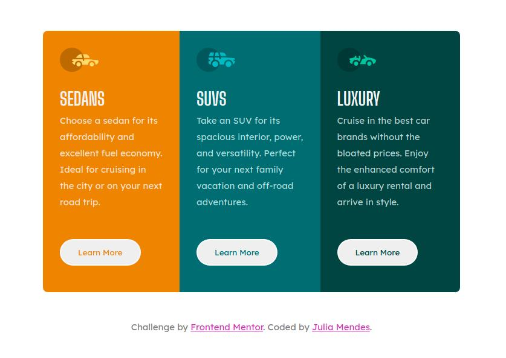

# Frontend Mentor - 3-column preview card component solution

This is a solution to the [3-column preview card component challenge on Frontend Mentor](https://www.frontendmentor.io/challenges/3column-preview-card-component-pH92eAR2-). Frontend Mentor challenges help you improve your coding skills by building realistic projects.

## Table of contents

- [Frontend Mentor - 3-column preview card component solution](#frontend-mentor---3-column-preview-card-component-solution)
  - [Table of contents](#table-of-contents)
  - [Overview](#overview)
    - [The challenge](#the-challenge)
    - [Screenshot](#screenshot)
    - [Links](#links)
  - [My process](#my-process)
    - [Built with](#built-with)
    - [What I learned](#what-i-learned)
    - [Continued development](#continued-development)
    - [Useful resources](#useful-resources)
  - [Author](#author)
  - [Acknowledgments](#acknowledgments)

**Note: Delete this note and update the table of contents based on what sections you keep.**

## Overview

### The challenge

Users should be able to:

- View the optimal layout depending on their device's screen size
- See hover states for interactive elements

### Screenshot

### Links

- Solution URL: [Add solution URL here](https://your-solution-url.com)
- Live Site URL: [Add live site URL here](https://your-live-site-url.com)

## My process

### Built with

- Semantic HTML5 markup
- CSS custom properties
- Flexbox
- Mobile-first workflow

### What I learned

In this challenge, I have managed to perform most of the challenge without seeking for any assistance. It was a good opportunity to feel more confident of my capabilities while useful to reassure my knowledge on responsive web design.

### Continued development

I identified the need to further practice responsiveness in CSS and to solidify flexbox understanding. Will focus on that in future projects.

### Useful resources

- [A Complete Guide to Flexbox](https://css-tricks.com/snippets/css/a-guide-to-flexbox/) - Very useful resource for flexbox.
- [Responsive Web Design Basics](https://web.dev/responsive-web-design-basics/) - This article goes through many concepts needed to understand the set up of a responsive web design.

## Author

- LinkedIn - [@juliamendesc](https://www.linkedin.com/in/juliamendesc/)
- Frontend Mentor - [@juliamendesc](https://www.frontendmentor.io/profile/juliamendesc)

## Acknowledgments

Thanks to [Amrin](https://coderamrin.hashnode.dev/) for the useful tips!
